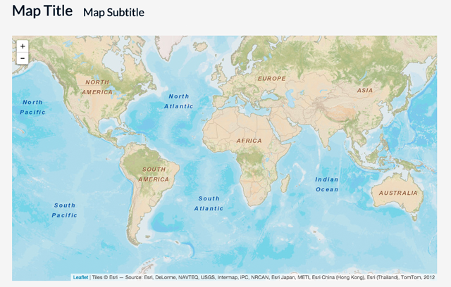

# Lab 04: JavaScript Arrays and Control Structures

**Instructions:** Begin by editing the *lab-04/lab-04-data/index.html* Starter Template to fulfill the requirements listed below. The goal of this lab is to update the code written in Lab 03 to again place 3 markers on the map for 3 different cities and provide popup information about their relative population sizes. However, we want to make the code less redundant by using arrays and looping structures, rather than separate variables for each respective city.

First launch the *lab-04/lab-04-data/index.html* Starter Template file using Live Preview in Brackets. You'll notice the map loads with the entire world in view.

  
Figure 01. The initial view of the Starter Template file.

Note that within the JavaScript already provided, there are three number values encoded within:

```javascript
var options = {
    center: [0, 0],
    zoom: 2
}
```
The `[0, 0]` following the word `center` is an array, the first value being the latitude of the center of the map, and the second being the longitude. The number `2` following `zoom` is the initial zoom level. Rather than mapping the same cities in Kentucky as in lab 03, choose three new cities. These can be within a US state, within another country, or three cities within three different countries. Choose one of them to be a capital city. Once you've decided on three cities, adjust these latitude, longitude, and zoom levels so that your map loads with the center roughly in the middle of these cities and so that they're all visible upon the page load (**1pt**).

When this is complete, note that a skeleton `for` loop has been constructed for you. You'll need to provide the necessary values within it to ensure it loops through all three cities, places them on the map, and updates their popup content with their relevant information. Continue to write JavaScript to fulfill the following requirements. 

1. Create a variable named `cities` that contains the String type names of your 3 cities, stored as an array (**.5pt**).

2. Create a 2-dimensional array named `cityCoords` that contains 3 elements: each one an array containing the latitude and longitude of each of the three cities listed in the `cities` array. Be careful to ensure that the index for each array of coordinates corresponds to the index for each city name in the `cities` array. In other words, if "Lexington" is the first city within the `cities` array, then Lexington's coordinates should be the first array within the `cityCoords` array (**.5pt**).

3. Create two more arrays, named `cityPops` and `cityCapital`. The `cityPops` array should contain the populations of the respective cities in the `cities` array (again, be careful with the order of these as they should be congruent with the other arrays already created). The `cityCapital` array should contain three Boolean values designating whether the corresponding city in the `cities` array is or is not the capital of the state or country you're mapping (**.5pt**).

4. After these data structures have been successfully built, un-comment the remaining code at the bottom of the script and edit the code, replacing the `/* add code here */` comments with actual JavaScript. You'll need to:

    a. Provide the three expressions within the `for` loop parentheses to ensure the loop cycles through all the elements within the `cities` Array (**1.5pt**).
    
    b. Access the correct values within the `cities` and `cityPops` arrays to construct the popup content with the cities' names and their populations (**1pt**).
    
    c. Access the correct value within the `cityCapital` array for each city to complete the expression within the `if ` statement to include the text indicating that the city is a capital city (**1pt**).
    
    d. Access the correct array within the `ciityCoords` array for each city to to be placed on the map within the parentheses of the `L.marker(/* add code here */)` (**1pt**).
    
Once these steps have been successfully completed, the map should load and operate just as the solution for Lab 03 (only the underlying JavaScript code will be running more efficiently with arrays and loops!). You may want to reference the Lab 03 solution for help.
    
5. Finally, change the `h1` and `h2` tags to update your web document with an appropriate (even fun!) title and subtitle, and edit the text at the bottom of the page (e.g., author and meta information) (**1pt**).

Save your changes to the *index.html* file and **commit changes to your local GitHub repository** as you work. 

Also, be sure that the *map672-spr16/module-04/lesson-04-data/index.html* file is complete with the examples detailed in the *lesson-04.md* instructions and Synced up with your GitHub repo (**2pts**)

Sync your final solutions with your remote repository and provide a link within Canvas by the due date.