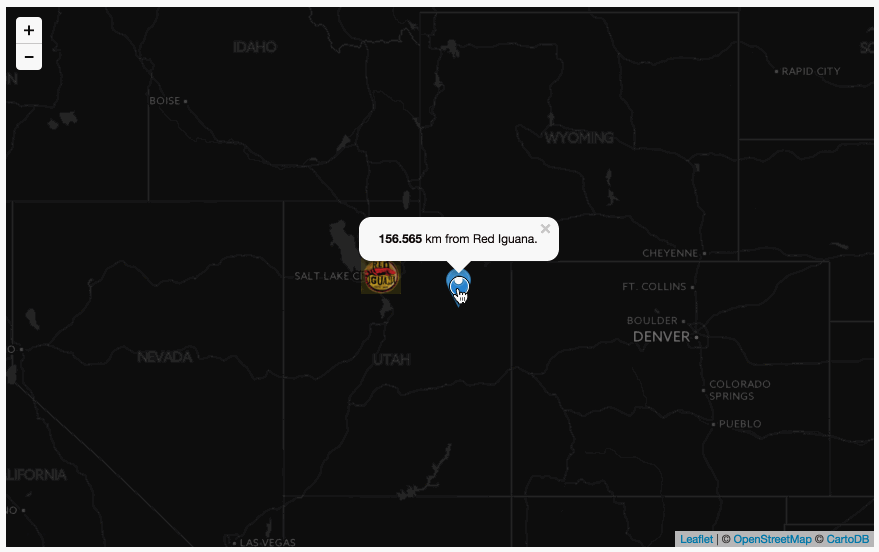
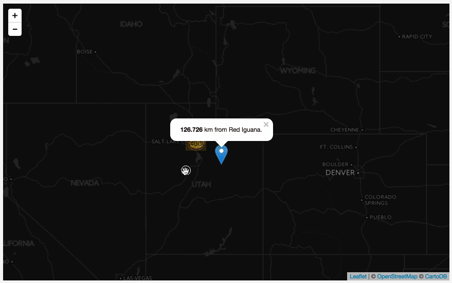

# Lab 07: Leaflet Map Basics

The goal of this lab is to create a Leaflet map that calculates the distance between a user click location and the location of the Red Iguana restaurant. Upon clicking on the map, a marker is created at that location. The distance between the marker and Red Iguana is displayed in a popup on that marker, which should open immediately. Additionally, the user is able to drag the marker to a new location. Upon ending the drag, the marker's popup is updated with the new distance. Your solution should look and behave like this:



Begin with the starter template document (*lab07-data/index,html*). You'll see that a Leaflet map object has already been created, centered on latitude 40 and longitude -94 (in Salt Lake City, UT), with a zoom level of 4. Currently there is no tilted basemap. Also, a Leaflet `LatLng` object has also been created using the coordinates of the Red Iguana restaurant and assigned to the variable `redIguana`. This `LatLng` object is then used to create a marker at that location using a custom icon image (*red_iguana.png*).

```javascript
var options = {
        center: [40.74,-110.61],
        zoom: 6
    }
    
var map = L.map('map', options);
                
var redIguana = L.latLng(40.7718,-111.9124);
    
L.marker(redIguana, {
    icon : L.icon({
        iconUrl: 'red_iguana.png',
        iconSize: [40, 36]
    })
}).addTo(map);
    
map.on('click', function(e){

    // output is o.LatLng {lat: 40.863679665481676, lng: -114.57847595214842}
    console.log(e.latlng);   
    
});
```

Finally, the Leaflet map `.on()` event method is being called and listening for a click event. The callback function then logs the `LatLng` object of that click event to the Console. Note that you will not see a tiled basemap yet. When you run this script in your browser, you'll see the click events logged to the Console.

Your task is to continue writing code to achieve the following. Save your changes to your *index.html* file and **commit changes to your local GitHub repository** as you work.

First look through the Leaflet-providers preview and choose a basemap of your liking ([http://leaflet-extras.github.io/leaflet-providers/preview/](http://leaflet-extras.github.io/leaflet-providers/preview/). Add this basemap tileset to the Leaflet map. Save your file and refresh the browser to verify that the map is now loading a tiled basemap. (**1pt**)

When the user clicks once on the map:

1. The lat/lon coordinates of the click event are stored with a reference to a variable. (**1pt**)
2. This variable is then used to create a new Leaflet marker and add it to the map. The marker should also be created with it's `draggable` option set to true. (**1pt**)
3. The distance between the click event and red iguana should be calculated, and stored with a reference to a variable. (**1pt**)
4. A popup string should be constructed using the calculated distance. Output of the string should be something like "442.594 km from Red Iguana." (**1pt**)
5. A `.on()` method should be invoked on the new marker so that when the user is done dragging it, the distance is recalculated and the popup is updated (hint: look at the [Draggable Events](http://leafletjs.com/reference.html#draggable) and the [`.setPopupContent()` method](http://leafletjs.com/reference.html#marker-setpopupcontent)) (**3pt**)

As usual, change the `h1` and `h2` tags to update your web document with an appropriate (even fun!) title and subtitle, and edit the text at the bottom of the page (e.g., author and meta information).

Also submit your *lesson-07-data/index.html* file with the script and commented code as requested at the end of Lesson 07. (**2pts**).

Sync your final solutions with your remote repository and provide a link within Canvas by the due date.

**Challenge:** As written, the current lab solution will create a new marker with each user click. Modify the script so that the previous marker is removed and a new one is created. Hint: consider creating an empty Leaflet layerGroup object outside of the `.on('click')` method. Then, within the `.on('click')` method's callback function, first remove any markers (a.k.a. layers) within the layerGroup, and then add the newly created marker. 

Your solution should look and behave like this:

